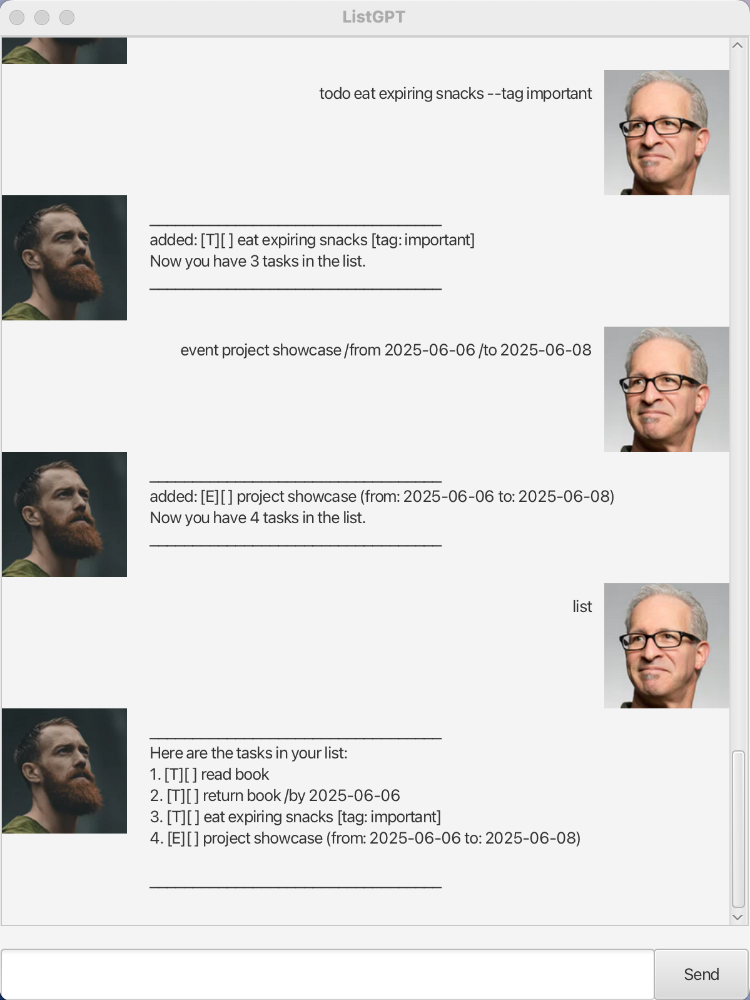

# ListGPT User Guide

Adapted from the Java mascot Duke, ListGPT helps you keep track of tasks using a Command Line Interface, with an option to use a Graphical User Interface.

## Command Reference

| Command            | Syntax                                                                  | Description                                        | Example                                                                                                                 |
|--------------------|-------------------------------------------------------------------------|----------------------------------------------------|-------------------------------------------------------------------------------------------------------------------------|
| **List all tasks** | `list`                                                                  | Displays all tasks currently in your task list.    | `list`                                                                                                                  |
| **Find tasks**     | `find <keyword>`                                                        | Shows tasks containing the keyword.                | `find book`                                                                                                             |
| **Mark task done** | `mark <index>`                                                          | Marks the task at position `<index>` as completed. | `mark 2`                                                                                                                |
| **Unmark task**    | `unmark <index>`                                                        | Marks the task at position `<index>` as not done.  | `unmark 2`                                                                                                              |
| **Delete task**    | `delete <index>`                                                        | Removes the task at position `<index>`.            | `delete 3`                                                                                                              |
| **Add ToDo**       | `todo <description> [--tag <tag>]`                                      | Adds a ToDo task with an optional tag.             | `todo read book` `todo buy groceries --tag errands`                                                                  |
| **Add Deadline**   | `deadline <description> /by <YYYY-MM-DD> [--tag <tag>]`                 | Adds a Deadline task with a due date.              | `deadline return book /by 2025-09-30` `deadline submit report /by 2025-10-01 --tag school`                           |
| **Add Event**      | `event <description> /from <YYYY-MM-DD> /to <YYYY-MM-DD> [--tag <tag>]` | Adds an Event task with a start and end date.      | `event project meeting /from 2025-09-20 /to 2025-09-21` `event hackathon /from 2025-11-01 /to 2025-11-03 --tag work` |

## Notes
- `<index>` refers to the number shown in the task list (starting from 1).
- Tags are optional, but can help you categorize tasks.
- Dates should follow the format `YYYY-MM-DD`.